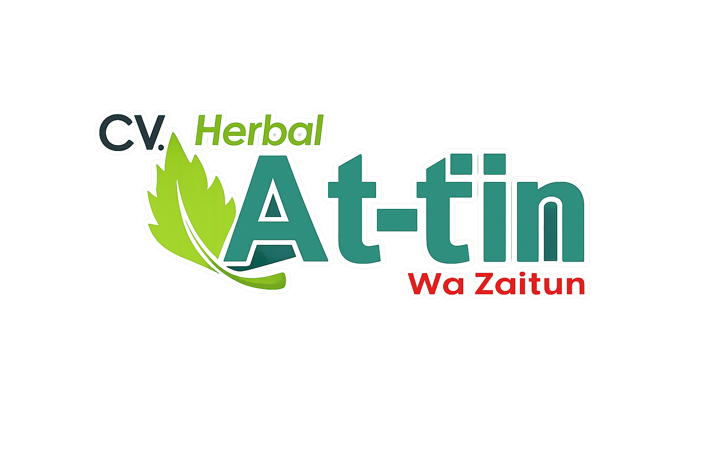

<table border="0" cellspacing="0" cellpadding="0">
  <tr>
    <td align="center" width="120">
      
       
      <b>Universitas Amikom</b>
    </td>
    <td align="center" width="60">
      
    </td>
    <td align="center" width="120">
      
       
      <b>CV. Herbal Attiin</b>
    </td>
  </tr>
</table>

# 🌿 Sistem Point of Sale — CV. Herbal Attiin

> Aplikasi POS berbasis web untuk digitalisasi operasional bisnis herbal tradisional Indonesia

---

## 📌 Tentang Project

**Sistem Point of Sale (POS) CV. Herbal Attiin** adalah aplikasi web yang dikembangkan sebagai Tugas Akhir program studi di **Universitas Amikom**. Proyek ini bertujuan mendigitalisasi dan mengoptimalkan alur bisnis **CV. Herbal Attiin** — sebuah usaha produk herbal tradisional — yang sebelumnya masih berjalan secara konvensional.

### Permasalahan yang Diselesaikan

| # | Masalah Sebelumnya | Solusi Sistem |
|---|---|---|
| 1 | Pencatatan transaksi manual & rawan kesalahan | Transaksi digital *real-time* dengan validasi otomatis |
| 2 | Monitoring stok tidak akurat | Manajemen inventaris dengan notifikasi stok kritis |
| 3 | Laporan penjualan dibuat manual | Laporan otomatis (harian/bulanan/tahunan) + ekspor PDF & Excel |
| 4 | Tidak ada pembatasan akses pengguna | Role-Based Access Control (RBAC) terstruktur |

---

## ✨ Fitur Utama

<b>📦 Manajemen Inventaris</b>

- CRUD lengkap untuk produk, kategori, dan satuan
- Pemantauan stok secara *real-time*
- Notifikasi otomatis saat stok mendekati batas minimum
- Riwayat perubahan stok (stock log)

<b>🛒 Transaksi Kasir (Point of Sale)</b>

- Antarmuka kasir yang responsif dan intuitif
- Pencarian produk cepat dengan barcode / nama
- Kalkulasi kembalian otomatis
- Dukungan multiple metode pembayaran (tunai, transfer)
- Cetak struk langsung atau simpan sebagai PDF

<b>👥 Role-Based Access Control (RBAC)</b>

- **Admin** — akses penuh: produk, laporan, manajemen pengguna
- **Kasir** — akses terbatas: transaksi & cetak struk
- Middleware proteksi rute berbasis role

<b>📊 Pelaporan & Analitik</b>

- Laporan penjualan: harian, bulanan, tahunan
- Grafik tren penjualan interaktif
- Ekspor laporan ke PDF dan Excel (`.xlsx`)
- Filter laporan berdasarkan rentang tanggal & kategori produk

<b>🧾 Manajemen Transaksi</b>

- Riwayat transaksi lengkap dengan status
- Detail per-transaksi dengan breakdown item
- Fitur batalkan transaksi 
- Cetak ulang struk dari riwayat

---

## 🏗 Arsitektur Sistem
